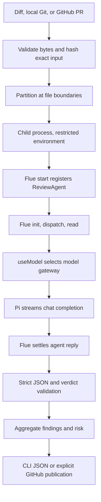

# PR review agent, Flue edition

A standalone Flue implementation of [pr-review-agent](https://github.com/wuchris-ch/pr-review-agent). It reviews unified diffs for security and correctness and produces the same strict JSON verdict. It supports raw diffs, local Git changes, manual GitHub PR reviews, and an explicitly started GitHub watcher.

**Installing, building, and testing do not start a watcher.** CI only verifies code against a local mock model endpoint. This repository contains no deployment workflow, scheduled review job, or credentials.

## Quick start

Requires Node.js **22.19.0 or newer** and npm. Local Git review requires Git; manual GitHub PR review requires an authenticated `gh` CLI.

```sh
npm ci
npm run verify
cp .env.example .env
chmod 600 .env
```

Fill in the three model gateway settings in `.env`. If you already have a configured `.env`, keep it. The gateway must support streaming OpenAI-compatible chat completions. `MODEL_GATEWAY_BASE_URL` is the API prefix, for example `https://gateway.example/v1`, without `/chat/completions`.

One manual review, with no GitHub writes:

```sh
npm run review -- --diff examples/safe.diff
```

`npm run review` loads the local `.env`. The commands below use Node's explicit environment-file flag. Direct binaries use the exported process environment.

## Commands

```sh
# Read a raw diff from a file or stdin.
node --env-file=.env dist/cli.js --diff changes.diff
cat changes.diff | node --env-file=.env dist/cli.js

# Supply optional repository review guidance, treated as untrusted context.
node --env-file=.env dist/cli.js --diff changes.diff --instructions review-guidance.md

# Review the current Git checkout against its merge base, including tracked edits.
node --env-file=/absolute/path/to/.env /absolute/path/to/dist/review.js --base main

# Read and review one GitHub PR. This does not publish anything.
node --env-file=.env dist/pr.js 123 --repo owner/repository

# Explicitly publish one COMMENT review when you choose to.
node --env-file=.env dist/pr.js 123 --repo owner/repository --publish
```

`npm link` optionally installs distinct commands so the original agent can coexist:

| Binary | Behavior |
| --- | --- |
| `pr-review-flue` | Local Git review, or `--pr` for a GitHub PR |
| `pr-review-flue-pr` | Manual GitHub PR review |
| `pr-review-flue-agent` | Raw unified diff to JSON |
| `pr-review-flue-watch` | Explicitly start continuous GitHub polling |

A valid verdict exits **0**, including a blocked verdict. Invalid input, execution failure, or invalid output exits **1**. Integrations must inspect `blocked` to decide whether a review passes.

## What actually uses Flue

Pinned framework version: **`@flue/runtime` 2.0.3**. Its Pi model integration is pinned to **`@earendil-works/pi-ai` 0.83.0**. Verified against the installed package and official documentation on **September 6, 2026**.



- [`src/agents/reviewer.ts`](src/agents/reviewer.ts) is a real Flue agent module with the `use agent` directive and `useModel` hook.
- [`src/agents/runtime.ts`](src/agents/runtime.ts) uses the supported standalone Node `start()` API and Flue's `init()`, `dispatch()`, `read()`, and `stop()` lifecycle. No web server or Vite build is needed for this CLI architecture.
- [`src/agents/gateway.ts`](src/agents/gateway.ts) registers a custom Pi provider for the configured model gateway. Pi owns chat serialization and SSE parsing; Flue owns agent execution and transient model retries. A wrapper enforces network limits and keeps the real model ID out of runtime metadata by using the public alias `reviewer`.
- [`src/runner.ts`](src/runner.ts) retains application policy: partitioning, child isolation, one fresh format-correction attempt, digest checks, file membership checks, aggregation, and final validation.
- [`src/watcher.ts`](src/watcher.ts) retains GitHub polling and publication. Flue does not control GitHub credentials or publication tools.

Each partition and format attempt gets a fresh conversation backed by Flue's **in-memory SQLite**. There is no cross-review memory or restart recovery. This deliberately preserves the original stateless review behavior. Persistent Flue conversations would require an explicit storage and lifecycle design.

This version remains a diff reviewer. It does not read arbitrary repository files, run tests on PR code, or invoke subagents. No sandbox is mounted, and the provider exposes no tools. The child-process boundary is not an OS security sandbox.

## Verdict and limits

```json
{
  "schema_version": "1.0",
  "input_sha256": "<SHA-256 of the exact complete diff bytes>",
  "risk": "low",
  "blocked": false,
  "findings": [],
  "rationale": "No actionable defects found."
}
```

Findings contain `severity`, `category`, `file`, `line`, and `detail`. A blocker means high risk; a major finding means at least medium risk. Either blocks the verdict. Minor/info-only findings are low risk and unblocked. Valibot validates shape; application checks enforce these relationships, the input digest, and partition file membership.

| Boundary | Limit |
| --- | --- |
| Complete UTF-8 diff | 1 MiB |
| Repository guidance | 16 KiB |
| Evaluator feedback, `AGENT_EVAL_FEEDBACK` | 16 KiB |
| Partition message | 96 KiB plus bounded format-correction instruction |
| File splitting | File boundaries only; an oversized individual file is rejected |
| Actual gateway HTTP requests | At most 3 per child, including retry requests |
| Per-request deadline | 35 seconds, including streamed response consumption |
| Requested output tokens | 4,096 |
| Gateway response | 1 MiB, enforced while reading the stream |
| Child runtime | 120 seconds |
| Format correction | At most one fresh child per partition |

Flue controls transient retry classification and backoff, so these differ from the original handwritten HTTP retry policy. The application still caps actual requests and total child execution. A partition can use up to six HTTP requests across both format attempts. Cost fields in the custom provider are zero placeholders, not billing estimates.

## Optional watcher, inactive until started

The watcher runs only when you explicitly execute its command. Before doing so, provide `GITHUB_TOKEN` and `GITHUB_REPOSITORIES` in the environment or local `.env`. The token needs read access to PRs and write access to reviews and commit statuses for the chosen repositories. Repository targets are comma-separated `owner/repository` names.

```sh
# This command enables continuous reviews and GitHub writes. Run only when desired.
npm run watch
```

The default interval is 60 seconds after each full polling pass; `REVIEW_POLL_INTERVAL_SECONDS` can override it, with a 15-second minimum. Repositories and PRs are processed sequentially.

The Flue watcher uses status context **`PR review agent (Flue)`** and marker `pr-review-agent-flue` so it does not share the original reviewer's completion markers or statuses. It publishes COMMENT reviews and commit statuses. Merge enforcement requires a separately configured GitHub branch rule.

Inherited watcher limitations: only the first 100 open PRs and first 100 reviews are fetched, duplicate suppression is not safe across simultaneous watcher instances, and the current implementation does not recheck the head revision before publication. Keep it disabled until those tradeoffs fit your rollout. JSON validation also does not prove findings are correct or ensure finding line numbers lie inside changed hunks.

## Privacy and configuration

Only generic gateway configuration names appear in this repository. Keep endpoints, credentials, and internal provider details in local environment files or your secret store. `.env`, `AGENTS.md`, database files, and runtime caches are ignored. Docker excludes these files too.

The model child receives an allowlist of environment variables. It receives model gateway configuration and optional telemetry settings, but no GitHub token. Raw review input travels over stdin, never as a process argument. The diff is sent to the configured model gateway.

OpenTelemetry is off unless an OTLP endpoint is configured. The application exports bounded metadata: input size, framework name, public model alias, duration, and success/failure. Automatic resource detection and content tracing are not enabled. Upstream HTTP error bodies are discarded; CLI errors omit SDK error details.

## Tests and container build

```sh
npm run verify
npm audit --audit-level=high
# Optional build only. Does not run the agent or publish an image.
docker build -t pr-review-agent-flue:local .
```

Tests cover original input/JSON/schema/partition/GitHub formatting behavior and run the **compiled CLI through the real Flue runtime and Pi transport** against a loopback SSE server. They verify format correction, digest rejection, blocking verdicts, transient recovery, authentication failures, request limits, and privacy boundaries. Tests require no model or GitHub credentials and do not load `.env`.

The container defaults to the one-shot raw-diff CLI. Running the watcher inside a container requires explicitly selecting `node dist/watcher.js` and supplying configuration. There are no deployment steps or schedules in GitHub Actions.

## References

- [Flue standalone Node runtime](https://flueframework.com/docs/reference/agent-api/#start)
- [Flue model provider integration](https://flueframework.com/docs/reference/provider-api/)
- [Flue durability](https://flueframework.com/docs/guide/durability/)

Licensed under Apache-2.0. Application review policy and adapters originate from `pr-review-agent`; this repository starts with independent Git history.
