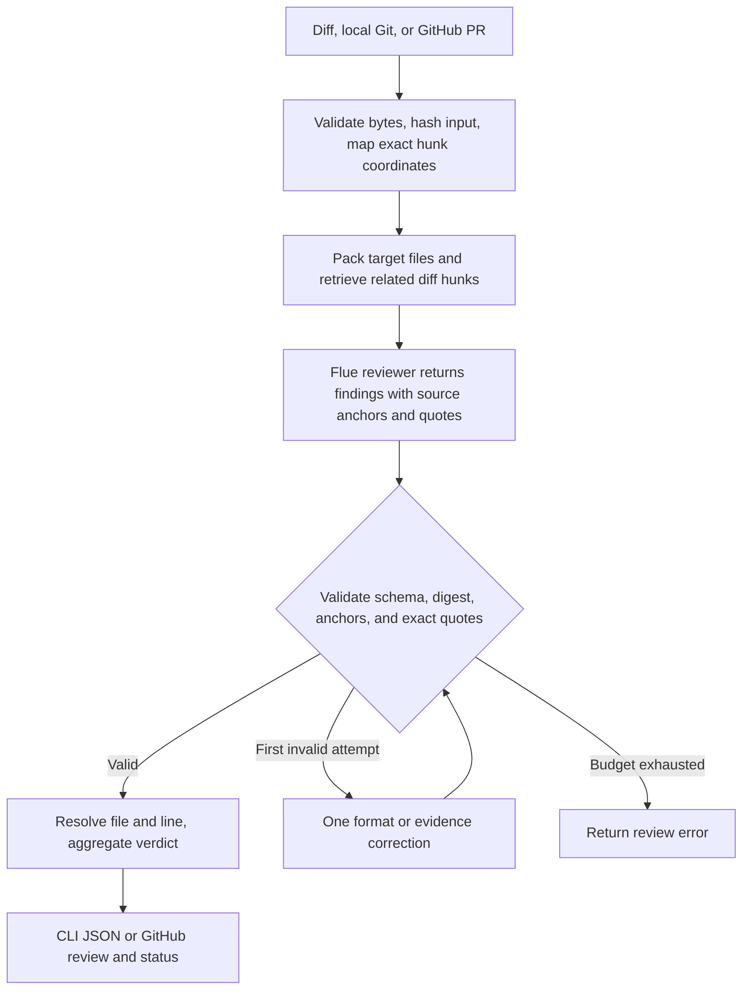

# PR review agent, Flue edition

A Flue reviewer for security and correctness that ties findings to verified source anchors and produces a stable JSON verdict. It supports raw diffs, local Git changes, manual GitHub PR reviews, and an explicitly started GitHub watcher.

**Installing, building, and testing do not start a watcher.** CI only verifies code against a local mock model endpoint. This repository contains no deployment workflow, scheduled review job, or credentials.

## Quick start

Requires Node.js **22.19.0 or newer** and npm. Local Git review requires Git; manual GitHub PR review requires an authenticated `gh` CLI.

```sh
npm ci
npm run verify
cp .env.example .env
chmod 600 .env
```

Fill in the three model gateway settings in `.env`. If you already have a configured `.env`, keep it. The gateway must support streaming OpenAI-compatible chat completions. `MODEL_GATEWAY_BASE_URL` is the API prefix, for example `https://gateway.example/v1`, without `/chat/completions`.

One manual review, with no GitHub writes:

```sh
npm run review -- --diff examples/safe.diff
```

`npm run review` loads the local `.env`. The commands below use Node's explicit environment-file flag. Direct binaries use the exported process environment.

## Commands

```sh
# Read a raw diff from a file or stdin.
node --env-file=.env dist/cli.js --diff changes.diff
cat changes.diff | node --env-file=.env dist/cli.js

# Supply optional repository review guidance, treated as untrusted context.
node --env-file=.env dist/cli.js --diff changes.diff --instructions review-guidance.md

# Review the current Git checkout against its merge base, including tracked edits.
node --env-file=/absolute/path/to/.env /absolute/path/to/dist/review.js --base main

# Read and review one GitHub PR. This does not publish anything.
node --env-file=.env dist/pr.js 123 --repo owner/repository

# Explicitly publish one COMMENT review when you choose to.
node --env-file=.env dist/pr.js 123 --repo owner/repository --publish
```

`npm link` installs the Flue commands and the original `pr-review`, `pr-review-pr`, `pr-review-agent`, and `pr-review-watch` names as compatibility aliases:

| Binary | Behavior |
| --- | --- |
| `pr-review-flue` | Local Git review, or `--pr` for a GitHub PR |
| `pr-review-flue-pr` | Manual GitHub PR review |
| `pr-review-flue-agent` | Raw unified diff to JSON |
| `pr-review-flue-watch` | Explicitly start continuous GitHub polling |

A valid verdict exits **0**, including a blocked verdict. Invalid input, execution failure, or invalid output exits **1**. Integrations must inspect `blocked` to decide whether a review passes.

## Review workflow

Pinned framework version: **`@flue/runtime` 2.0.3**. Its Pi model integration is pinned to **`@earendil-works/pi-ai` 0.83.0**. Verified against the installed package and official documentation on **September 6, 2026**.



- [`src/agents/reviewer.ts`](src/agents/reviewer.ts) is a real Flue agent module with the `use agent` directive and `useModel` hook.
- [`src/agents/runtime.ts`](src/agents/runtime.ts) uses the supported standalone Node `start()` API and Flue's `init()`, `dispatch()`, `read()`, and `stop()` lifecycle. No web server or Vite build is needed for this CLI architecture.
- [`src/agents/gateway.ts`](src/agents/gateway.ts) registers a custom Pi provider for the configured model gateway. Pi owns chat serialization and SSE parsing; Flue owns agent execution and transient model retries. A wrapper enforces network limits and keeps the real model ID out of runtime metadata by using the public alias `reviewer`.
- [`src/evidence.ts`](src/evidence.ts) maps old and new hunk coordinates, labels source anchors, retrieves related hunks across partitions, and validates exact evidence quotes. The model selects an anchor; the application supplies the public finding file and line.
- [`src/runner.ts`](src/runner.ts) owns child isolation, one shared format/evidence correction attempt per partition, complete-review budgets, digest checks, aggregation, and optional per-attempt diagnostics.
- [`src/watcher.ts`](src/watcher.ts) retains GitHub polling and publication. Flue does not control GitHub credentials or publication tools.

Each partition and correction attempt gets a fresh conversation backed by Flue's **in-memory SQLite**. There is no cross-review memory or restart recovery. This deliberately preserves the original stateless review behavior. Persistent Flue conversations would require an explicit storage and lifecycle design.

Context retrieval searches only the supplied diff. Related hunks are ranked by shared code identifiers and remain read-only evidence for the current partition. Each file is reviewed as a target once. Unchanged files outside the diff are not loaded; include their relevant context when a caller contract is needed. The workflow uses one reviewer and deterministic evidence verification, with no second opinion agent or execution of PR code.

## Verdict and limits

```json
{
  "schema_version": "1.0",
  "input_sha256": "<SHA-256 of the exact complete diff bytes>",
  "risk": "low",
  "blocked": false,
  "findings": [],
  "rationale": "No actionable defects found."
}
```

Findings contain `severity`, `category`, `file`, `line`, and `detail`. A blocker means high risk; a major finding means at least medium risk. Either blocks the verdict. Minor/info-only findings are low risk and unblocked. Valibot validates shape; application checks enforce these relationships, the input digest, source membership, and exact quotes. Findings cite added operations. Deletion-only changes retain their base-file line number and explicitly label the evidence as `base`; other locations refer to the head version. Related evidence includes its own file, line, version side, and quote.

| Boundary | Limit |
| --- | --- |
| Complete UTF-8 diff | 1 MiB |
| Repository guidance | 16 KiB |
| Evaluator feedback, `AGENT_EVAL_FEEDBACK` | 16 KiB |
| Partition message, including correction | 96 KiB |
| Related diff context per partition | 16 KiB, at most 4 complete hunks |
| Partitions / total model attempts | 24 / 32 |
| File splitting | File boundaries only; an oversized individual file is rejected |
| Actual gateway HTTP requests | At most 3 per child, including retry requests |
| Per-request deadline | 35 seconds, including streamed response consumption |
| Requested output tokens | 4,096 |
| Gateway response | 1 MiB, enforced while reading the stream |
| Complete review, including every child | 120 seconds |
| Format or evidence correction | At most one fresh child per partition, sharing the same budget |

Flue controls transient retry classification and backoff, so these differ from the original handwritten HTTP retry policy. The application still caps actual requests and total child execution. A partition can use up to six HTTP requests across both format attempts. Cost fields in the custom provider are zero placeholders, not billing estimates.

## Continuous GitHub reviews

The production worker is managed by the companion [agent-eval-platform](https://github.com/wuchris-ch/agent-eval-platform) stack, which explicitly runs `node dist/watcher.js`. It replaces the original worker using the same runtime Secret and repository configuration. The daily independent evaluation also uses this Flue implementation. Local installation does not start a watcher. Before doing so, provide `GITHUB_TOKEN` and `GITHUB_REPOSITORIES` in the environment or local `.env`. The token needs read access to PRs and write access to reviews and commit statuses for the chosen repositories. Repository targets are comma-separated `owner/repository` names.

```sh
# This command enables continuous reviews and GitHub writes. Run only when desired.
npm run watch
```

The default interval is 60 seconds after each full polling pass; `REVIEW_POLL_INTERVAL_SECONDS` can override it, with a 15-second minimum. Repositories and PRs are processed sequentially.

The watcher preserves status context **`PR review agent`** and the policy-2 marker. Each new review also records the base tip, merge base, head, exact diff hash, and verdict in a structured receipt. GitHub reviews explicitly set `commit_id` to the reviewed head, and final statuses link to that review.

The worker refreshes the PR and resolves its current target branch ref before fetching an immutable merge-base/head comparison. PR metadata can retain an older base SHA after that branch advances, so every snapshot reads the actual branch ref. It rechecks base/head after fetching, before posting, and around final status publication. When it observes a change, it defers to the next poll. A lost publication response is reconciled against saved review receipts; a restart after review creation can restore the status without another model call or duplicate review. Unchanged receipts avoid redundant diff downloads and status writes.

An open PR with only an older head-only marker gets one fully bound review, then participates in receipt-based deduplication. The first 100 open PRs are polled; review history is paginated up to 1,000 entries. Comparison responses at GitHub's 300-file cap are rejected so partial file coverage cannot produce a passing review. Run one worker; the companion stack uses a Recreate deployment strategy.

GitHub review and status writes are separate from branch updates. Explicit commit IDs keep a review attached to the analyzed revision, and observed revision changes invalidate its status until reconciliation. Merge enforcement uses the repository's branch rules.

## Privacy and configuration

Only generic gateway configuration names appear in this repository. Keep endpoints, credentials, and internal provider details in local environment files or your secret store. `.env`, `AGENTS.md`, database files, and runtime caches are ignored. Docker excludes these files too.

The model child receives an allowlist of environment variables. It receives model gateway configuration and optional telemetry settings, but no GitHub token. Raw review input travels over stdin, never as a process argument. The diff is sent to the configured model gateway.

OpenTelemetry is off unless an OTLP endpoint is configured. The application exports bounded metadata: input size, framework name, public model alias, duration, and success/failure. Automatic resource detection and content tracing are not enabled. Upstream HTTP error bodies are discarded; CLI errors omit SDK error details.

## Tests and container build

```sh
npm run verify
npm audit --audit-level=high
python3 scripts/test-regressions.py
# Optional build only. Does not run the agent or publish an image.
docker build -t pr-review-agent-flue:local .
```

Tests cover input/JSON/schema/partition/GitHub formatting behavior, source mapping, exact evidence checks, and bounded context retrieval and run the **compiled CLI through the real Flue runtime and Pi transport** against a loopback SSE server. They verify format correction, digest rejection, blocking verdicts, transient recovery, authentication failures, request limits, and privacy boundaries. Tests require no model or GitHub credentials and do not load `.env`.

The container defaults to the one-shot raw-diff CLI. Running the watcher inside a container requires explicitly selecting `node dist/watcher.js` and supplying configuration. There are no deployment steps or schedules in GitHub Actions.

## Development comparisons

The [September 12 paired comparison](docs/results/2026-09-12-evidence.md) records all 144 main invocations, the retained pilot, unchanged strict release gates, request accounting, and latency for both reviewers.

[Four multi-file regression examples](examples/regressions/manifest.json) pair broken required-error and shell-execution flows with valid fallback and safely quoted controls. `python3 scripts/test-regressions.py` checks their behavior independently of the reviewer. The command-execution fixtures use a mocked subprocess call and never execute the injected strings.

A paired comparison preserves both compiled checkouts and alternates invocation order, sequentially using the same configured gateway:

```sh
node scripts/compare-reviewers.mjs \
  --baseline /absolute/path/to/baseline \
  --candidate /absolute/path/to/candidate \
  --cases examples/regressions/manifest.json \
  --trials 3 --out /absolute/private/path/comparison.json
```

To reproduce the 24-case development comparison, use an evaluator checkout pinned to `048a8d4` and its Python environment. `scripts/prepare-comparison.py --evaluator EVALUATOR_DIR --out-dir PRIVATE_RUN_DIR` validates the familiar corpus and freezes it alongside the four authored examples. Pass the resulting `cases.json` to the comparison harness. `scripts/inspect-comparison.mjs` decodes initial responses with each checkout's own validator; `scripts/score-comparison.py` uses the pinned evaluator's unchanged scorer and complete strict gate. Raw, inspected, and scored reports remain separate files.

The harness runs 1 to 3 rounds over at most 32 development cases, with a 120-second limit per invocation and no evaluator feedback. It records every invocation, initial/correction requests, latency, source identity, and usage when the gateway supplies it. Existing reports cannot be overwritten. A loopback streaming proxy records responses locally; report files contain review content and use owner-only permissions. Publish a reviewed summary, keeping the raw reports local. The known evaluator corpus and these fixtures are development data; independent holdout evaluation is maintained by the evaluator project.

## References

- [Flue standalone Node runtime](https://flueframework.com/docs/reference/agent-api/#start)
- [Flue model provider integration](https://flueframework.com/docs/reference/provider-api/)
- [Flue durability](https://flueframework.com/docs/guide/durability/)
- [GitHub immutable comparisons](https://docs.github.com/en/rest/commits/commits#compare-two-commits)
- [GitHub review commit binding](https://docs.github.com/en/rest/pulls/reviews#create-a-review-for-a-pull-request)

Licensed under Apache-2.0. Application review policy and adapters originate from `pr-review-agent`; this repository starts with independent Git history.
