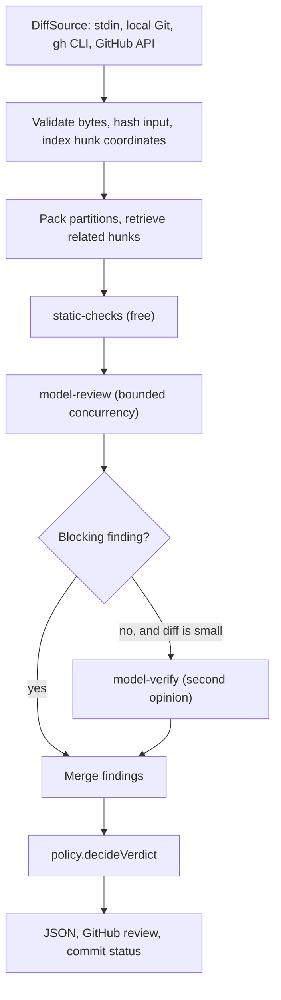

# PR review agent, Flue edition

A Flue reviewer for security and correctness that ties findings to verified source anchors and produces a stable JSON verdict. It supports raw diffs, local Git changes, manual GitHub PR reviews, and an explicitly started GitHub watcher.

**Installing, building, and testing do not start a watcher.** CI only verifies code against a local mock model endpoint. This repository contains no deployment workflow, scheduled review job, or credentials.

## Quick start

Requires Node.js **22.19.0 or newer** and npm. Local Git review requires Git; manual GitHub PR review requires an authenticated `gh` CLI.

```sh
npm ci
npm run verify
cp .env.example .env
chmod 600 .env
```

Fill in the three model gateway settings in `.env`. If you already have a configured `.env`, keep it. The gateway must support streaming OpenAI-compatible chat completions. `MODEL_GATEWAY_BASE_URL` is the API prefix, for example `https://gateway.example/v1`, without `/chat/completions`.

One manual review, with no GitHub writes:

```sh
npm run review -- --diff examples/safe.diff
```

`npm run review` loads the local `.env`. The commands below use Node's explicit environment-file flag. Direct binaries use the exported process environment.

## Commands

```sh
# Read a raw diff from a file or stdin.
node --env-file=.env dist/cli.js --diff changes.diff
cat changes.diff | node --env-file=.env dist/cli.js

# Supply optional repository review guidance, treated as untrusted context.
node --env-file=.env dist/cli.js --diff changes.diff --instructions review-guidance.md

# Review the current Git checkout against its merge base, including tracked edits.
node --env-file=/absolute/path/to/.env /absolute/path/to/dist/review.js --base main

# Read and review one GitHub PR. This does not publish anything.
node --env-file=.env dist/pr.js 123 --repo owner/repository

# Explicitly publish one COMMENT review when you choose to.
node --env-file=.env dist/pr.js 123 --repo owner/repository --publish
```

`npm link` installs the Flue commands and the original `pr-review`, `pr-review-pr`, `pr-review-agent`, and `pr-review-watch` names as compatibility aliases:

| Binary | Behavior |
| --- | --- |
| `pr-review-flue` | Local Git review, or `--pr` for a GitHub PR |
| `pr-review-flue-pr` | Manual GitHub PR review |
| `pr-review-flue-agent` | Raw unified diff to JSON |
| `pr-review-flue-watch` | Explicitly start continuous GitHub polling |

A valid verdict exits **0**, including a blocked verdict. Invalid input, execution failure, or invalid output exits **1**. Integrations must inspect `blocked` to decide whether a review passes.

## Architecture

The review runs as a pipeline of stages over a diff that has already been
indexed into exact source anchors. Stages share one contract, so a
deterministic detector and a model call compose the same way, and a later
stage can decide whether it is still needed based on what earlier ones found.



| Layer | Responsibility |
| --- | --- |
| [`src/sources`](src/sources) | Where a diff comes from. One adapter per input behind `DiffSource`. |
| [`src/core`](src/core) | Diff indexing, evidence grounding, strict JSON, schema, verdict policy, budgets. |
| [`src/stages`](src/stages) | The pipeline and its stages. New checks are added here. |
| [`src/agents`](src/agents) | Flue runtime, model gateway provider, isolated child process. |
| [`src/render`](src/render) | Output formatting, currently GitHub Markdown. |
| [`src/cli`](src/cli) | Command registry. Every binary is the same harness with a fixed subcommand. |
| [`src/telemetry`](src/telemetry) | Per-run JSONL records for replay and evaluation. |

Pinned framework version: **`@flue/runtime` 2.0.3**. Its Pi model integration is pinned to **`@earendil-works/pi-ai` 0.83.0**. Verified against the installed package and official documentation on **September 6, 2026**.

### Stages

`static-checks` runs deterministic detectors over the added lines and costs
nothing. It exists so a leaked credential, disabled certificate verification,
or a `write-all` workflow does not depend on model judgement. Its findings
carry real file and line numbers because it reads the same anchor index the
model sees.

`model-review` sends each partition to the reviewer. Partitions run through a
bounded worker pool, and each one draws its own deadline from the review
deadline, so a larger diff costs throughput rather than becoming impossible
to finish.

`model-verify` is a second independent pass, and it runs only when the review
is otherwise clean and the diff is small enough to be worth one. A missed
defect is the expensive error for a security reviewer, so a clean verdict on
a small change earns one more look. It is optional by contract: if it fails,
the review still stands and the rationale says the stage did not complete, so
an absent check is never mistaken for a passing one. Set
`REVIEW_VERIFY_STAGE=off` to disable it.

Findings that share a file, line, and category are treated as one defect.
Overlap between a detector and the model is agreement, not two problems: the
more severe report wins and the detail notes that something else concurred.

### Verdict policy

[`src/core/policy.ts`](src/core/policy.ts) is the only definition of how
findings become a risk level and a blocking decision. The schema validator
calls it, the pipeline calls it, and the system prompt is rendered from the
same rule table, so the text the model is given cannot drift from the rules
the application enforces. Adding a severity tier means adding one row.

### Evidence grounding

[`src/core/diff`](src/core/diff) maps old and new hunk coordinates and labels
every source line with an anchor. [`src/core/grounding.ts`](src/core/grounding.ts)
requires each finding to cite a supplied anchor and quote that line exactly.
The model selects an anchor; the application resolves the file and line. A
finding can therefore never point somewhere the diff does not support.

Retrieval never leaves the supplied diff. Related hunks come from other
partitions of the same change, ranked by shared identifiers, and stay
read-only evidence. Unchanged files outside the diff are not loaded.

Each partition and correction attempt gets a fresh conversation in an
isolated child process backed by Flue's in-memory SQLite. There is no
cross-review memory or restart recovery.

### Failure handling

A transient child failure is retried once with a fresh child, because the
gateway can stall until the child's internal deadline. A rejection that no
retry can fix, such as an incomplete configuration or a refused credential,
exits with a distinct code and is not retried. Bad model output gets one
corrective prompt; a dead child gets the same prompt again. A required stage
that still fails ends the review rather than returning a partial verdict.

### Configuration

| Variable | Default | Meaning |
| --- | --- | --- |
| `REVIEW_CONCURRENCY` | 6 | Partitions reviewed at once, bounding concurrent child processes. |
| `REVIEW_PARTITION_KIB` | 48 | Preferred agent message size. Smaller partitions answer faster; the 96 KiB ceiling still applies. |
| `REVIEW_REASONING_EFFORT` | low | How much the model thinks before answering, or `default` to leave it to the gateway. |
| `REVIEW_MAX_OUTPUT_TOKENS` | 32768 | Output tokens per reply. Reasoning is billed against this. |
| `REVIEW_GATEWAY_TIMEOUT_SECONDS` | 180 | Total network time one child may spend across its attempts. |
| `REVIEW_PARTITION_TIMEOUT_SECONDS` | 210 | Wall clock for one partition attempt. |
| `REVIEW_DEADLINE_SECONDS` | 900 | Wall clock for the whole review across every stage. |
| `REVIEW_VERIFY_STAGE` | on | Whether the gated second opinion runs. |
| `REVIEW_VERIFY_MAX_PARTITIONS` | 4 | Largest diff, in partitions, worth a second opinion. |
| `REVIEW_WATCH_CONCURRENCY` | 2 | Pull requests reviewed at once by the watcher. |
| `REVIEW_RUN_LOG_DIR` | unset | Directory for per-run JSONL records. Unset keeps them in memory. |

## Verdict and limits

```json
{
  "schema_version": "1.0",
  "input_sha256": "<SHA-256 of the exact complete diff bytes>",
  "risk": "low",
  "blocked": false,
  "findings": [],
  "rationale": "No actionable defects found."
}
```

Findings contain `severity`, `category`, `file`, `line`, and `detail`. A blocker means high risk; a major finding means at least medium risk. Either blocks the verdict. Minor/info-only findings are low risk and unblocked. Valibot validates shape; application checks enforce these relationships, the input digest, source membership, and exact quotes. Findings cite added operations. Deletion-only changes retain their base-file line number and explicitly label the evidence as `base`; other locations refer to the head version. Related evidence includes its own file, line, version side, and quote.

| Boundary | Limit |
| --- | --- |
| Complete UTF-8 diff | 1 MiB |
| Repository guidance | 16 KiB |
| Evaluator feedback, `AGENT_EVAL_FEEDBACK` | 16 KiB |
| Partition message, including correction | 96 KiB |
| Related diff context per partition | 16 KiB, at most 4 complete hunks |
| Preferred partition message | 48 KiB, `REVIEW_PARTITION_KIB` |
| Partitions per review | 48 |
| File splitting | File boundaries only. A file above the preferred size gets its own partition, and is rejected only if it exceeds the 96 KiB ceiling |
| Actual gateway HTTP requests | At most 2 per child, including retry requests |
| Network deadline | 180 seconds per child, shared across its attempts, `REVIEW_GATEWAY_TIMEOUT_SECONDS` |
| Requested output tokens | 32,768, `REVIEW_MAX_OUTPUT_TOKENS` |
| Gateway response | 1 MiB, enforced while reading the stream |
| One partition attempt, including its child | 210 seconds, `REVIEW_PARTITION_TIMEOUT_SECONDS` |
| Complete review, every stage and partition | 900 seconds, `REVIEW_DEADLINE_SECONDS` |
| Partitions reviewed concurrently | 6, `REVIEW_CONCURRENCY` |
| Retries of a failed child, per attempt | 1, and none for a non-retryable rejection |
| Format or evidence correction | At most one fresh child per partition, with its own deadline |

Flue controls transient retry classification and backoff inside a child. The application caps actual requests per child and bounds total execution with the deadlines above. A partition can reach eight upstream requests in the worst case: two format attempts, each retried once after a transient child failure, at two requests per child. Cost fields in the custom provider are zero placeholders, not billing estimates.

The budgets above nest, and that ordering is load-bearing. A child's shared network budget is smaller than the read timeout it sits inside, which is smaller than the partition deadline the parent enforces. When an inner budget is larger than an outer one, a timeout stops being reported as a timeout and instead surfaces as an unexplained stall, because the outer layer kills the child before the inner layer can name the reason.

Output tokens deserve particular care because the reviewer model reasons before answering and that reasoning is billed against the same budget. Too small a budget truncates the reply mid-object, or returns an empty reply with an HTTP 200 when reasoning consumes all of it. `REVIEW_REASONING_EFFORT` bounds the thinking itself, which is more predictable than bounding the total: without it, a small clean diff can spend minutes second-guessing itself, since a model with no defect to find keeps looking until its budget runs out. Any change to that level should be judged with `npm run eval:full` and `npm run eval:holdout` rather than by inspection.

## Continuous GitHub reviews

The production worker is managed by the companion [agent-eval-platform](https://github.com/wuchris-ch/agent-eval-platform) stack, which explicitly runs `node dist/watcher.js`. It replaces the original worker using the same runtime Secret and repository configuration. The daily independent evaluation also uses this Flue implementation. Local installation does not start a watcher. Before doing so, provide `GITHUB_TOKEN` and `GITHUB_REPOSITORIES` in the environment or local `.env`. The token needs read access to PRs and write access to reviews and commit statuses for the chosen repositories. Repository targets are comma-separated `owner/repository` names.

```sh
# This command enables continuous reviews and GitHub writes. Run only when desired.
npm run watch
```

The default interval is 60 seconds after each full polling pass; `REVIEW_POLL_INTERVAL_SECONDS` can override it, with a 15-second minimum. Repositories are polled in order, and pull requests within a repository are reviewed `REVIEW_WATCH_CONCURRENCY` at a time. Total concurrent model children is that value multiplied by `REVIEW_CONCURRENCY`.

A revision the process has already reconciled is skipped on later polls, so an unchanged pull request costs one metadata request instead of a full review-history page walk. GitHub receipts remain the durable source of truth; a restart clears the in-memory set and reconciles again from them.

The watcher preserves status context **`PR review agent`** and the policy-2 marker. Each new review also records the base tip, merge base, head, exact diff hash, and verdict in a structured receipt. GitHub reviews explicitly set `commit_id` to the reviewed head, and final statuses link to that review.

The worker refreshes the PR and resolves its current target branch ref before fetching an immutable merge-base/head comparison. PR metadata can retain an older base SHA after that branch advances, so every snapshot reads the actual branch ref. It rechecks base/head after fetching, before posting, and around final status publication. When it observes a change, it defers to the next poll. A lost publication response is reconciled against saved review receipts; a restart after review creation can restore the status without another model call or duplicate review. Unchanged receipts avoid redundant diff downloads and status writes.

An open PR with only an older head-only marker gets one fully bound review, then participates in receipt-based deduplication. The first 100 open PRs are polled; review history is paginated up to 1,000 entries. Comparison responses at GitHub's 300-file cap are rejected so partial file coverage cannot produce a passing review. Run one worker; the companion stack uses a Recreate deployment strategy.

GitHub review and status writes are separate from branch updates. Explicit commit IDs keep a review attached to the analyzed revision, and observed revision changes invalidate its status until reconciliation. Merge enforcement uses the repository's branch rules.

## Privacy and configuration

Only generic gateway configuration names appear in this repository. Keep endpoints, credentials, and internal provider details in local environment files or your secret store. `.env`, `AGENTS.md`, database files, and runtime caches are ignored. Docker excludes these files too.

The model child receives an allowlist of environment variables. It receives model gateway configuration and optional telemetry settings, but no GitHub token. Raw review input travels over stdin, never as a process argument. The diff is sent to the configured model gateway.

OpenTelemetry is off unless an OTLP endpoint is configured. The application exports bounded metadata: input size, framework name, public model alias, duration, and success/failure. Automatic resource detection and content tracing are not enabled. Upstream HTTP error bodies are discarded; CLI errors omit SDK error details.

## Tests and container build

```sh
npm run verify
npm audit --audit-level=high
python3 scripts/test-regressions.py
# Optional build only. Does not run the agent or publish an image.
docker build -t pr-review-agent-flue:local .
```

The test tree mirrors `src`. Tests cover diff indexing and path decoding, exact evidence checks, bounded context retrieval, the verdict policy, stage gating and merge rules, deterministic detectors, deadlines and the concurrency pool, transient-failure retries and the optional-stage fail-open contract, every diff source, the command registry, run records, and GitHub formatting. They also run the **compiled CLI through the real Flue runtime and Pi transport** against a loopback SSE server, verifying format correction, digest rejection, blocking verdicts, transient recovery, non-retryable rejections, request limits, and privacy boundaries. Tests require no model or GitHub credentials and do not load `.env`.

`npm run lint` runs Biome over `src`, `tests`, and `scripts`; `npm run format` applies it. CI runs the linter before the type check.

The container defaults to the one-shot raw-diff CLI. Running the watcher inside a container requires explicitly selecting `node dist/watcher.js` and supplying configuration. There are no deployment steps or schedules in GitHub Actions.

## Evaluation

`evals/manifest.json` holds labelled cases in three sets. Objective outcomes
are enforced: whether a review blocks, and whether it points at the expected
file and line. Everything else, including severity wording and rationale
quality, is reported in the summary and never gates, because there is no
correct answer a harness can check.

```sh
npm run eval:smoke     # 3 cases, pre-merge signal
npm run eval:full      # 6 cases, before a release or after a prompt change
npm run eval:holdout   # 2 cases, never used while tuning
```

The holdout set is disjoint from the tuning sets, and a unit test enforces
that separation along with parsing every case diff and resolving every
expected location, so a malformed case fails in seconds instead of after a
paid run. Results land in `evals/results/<timestamp>-<set>/` as a
schema-versioned `results.json` and a `summary.md`; the directory is ignored
by Git because reviews contain repository content.

Setting `REVIEW_RUN_LOG_DIR` records one JSON line per review with stage
timings, per-attempt outcomes, latency, and the input digest. This is the
data to read when a review is slow or a verdict needs explaining.

## Development comparisons

The [September 12 paired comparison](docs/results/2026-09-12-evidence.md) records all 144 main invocations, the retained pilot, unchanged strict release gates, request accounting, and latency for both reviewers.

[Four multi-file regression examples](examples/regressions/manifest.json) pair broken required-error and shell-execution flows with valid fallback and safely quoted controls. `python3 scripts/test-regressions.py` checks their behavior independently of the reviewer. The command-execution fixtures use a mocked subprocess call and never execute the injected strings.

A paired comparison preserves both compiled checkouts and alternates invocation order, sequentially using the same configured gateway:

```sh
node scripts/compare-reviewers.mjs \
  --baseline /absolute/path/to/baseline \
  --candidate /absolute/path/to/candidate \
  --cases examples/regressions/manifest.json \
  --trials 3 --out /absolute/private/path/comparison.json
```

To reproduce the 24-case development comparison, use an evaluator checkout pinned to `048a8d4` and its Python environment. `scripts/prepare-comparison.py --evaluator EVALUATOR_DIR --out-dir PRIVATE_RUN_DIR` validates the familiar corpus and freezes it alongside the four authored examples. Pass the resulting `cases.json` to the comparison harness. `scripts/inspect-comparison.mjs` decodes initial responses with each checkout's own validator; `scripts/score-comparison.py` uses the pinned evaluator's unchanged scorer and complete strict gate. Raw, inspected, and scored reports remain separate files.

The harness runs 1 to 3 rounds over at most 32 development cases, with a 120-second limit per invocation and no evaluator feedback. It records every invocation, initial/correction requests, latency, source identity, and usage when the gateway supplies it. Existing reports cannot be overwritten. A loopback streaming proxy records responses locally; report files contain review content and use owner-only permissions. Publish a reviewed summary, keeping the raw reports local. The known evaluator corpus and these fixtures are development data; independent holdout evaluation is maintained by the evaluator project.

## References

- [Flue standalone Node runtime](https://flueframework.com/docs/reference/agent-api/#start)
- [Flue model provider integration](https://flueframework.com/docs/reference/provider-api/)
- [Flue durability](https://flueframework.com/docs/guide/durability/)
- [GitHub immutable comparisons](https://docs.github.com/en/rest/commits/commits#compare-two-commits)
- [GitHub review commit binding](https://docs.github.com/en/rest/pulls/reviews#create-a-review-for-a-pull-request)

Licensed under Apache-2.0. Application review policy and adapters originate from `pr-review-agent`; this repository starts with independent Git history.
