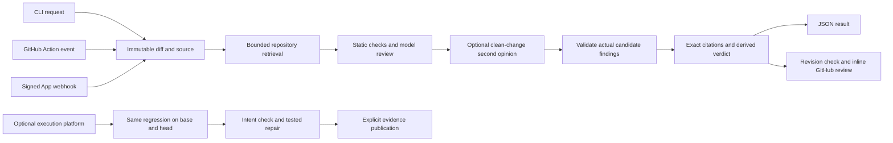

# Architecture

The CLI, GitHub Action and GitHub App share one review engine and one GitHub publication path. The optional execution platform has a separate service boundary because it runs repository code in Docker.

## Evidence and retrieval

The parser assigns deterministic source anchors. Model findings must cite an eligible changed line and quote its exact source. Unchanged repository context gets separate read-only anchors and cannot become a blame location. The input digest is checked independently of the model's verdict.

Retrieval scans at most 40 candidate paths and 256 KiB, reads at most 32 KiB per file, retains 12 ranked files, and contributes at most 12 KiB to a partition. Ranking uses changed paths, identifiers and test/contract filenames. It is bounded lexical retrieval, not a whole-repository call graph. GitHub tree truncation fails explicitly. Secret-file patterns, dependency/build directories and Git symlinks are excluded from context.

Each model partition runs in a fresh Flue child with an environment allowlist. Children receive model settings but no GitHub credential, repository shell tool or arbitrary network tool. The parent limits message/output bytes, concurrency, retries and deadlines. Required model review or candidate validation failure fails the review. An unavailable optional second opinion is reported as incomplete.

Candidate validation examines each draft against the same grounded evidence, checks callers, guards and intended behavior, and can discard unsupported allegations. It cannot invent a new location/category or raise severity. Draft findings and their rationale are replaced only after successful validation. Static findings remain. This is an additional evidence check using a fresh conversation, not a statistical independence guarantee.

## GitHub lifecycle

`src/github/run.ts` applies base-branch configuration and shared engine behavior. `review.ts` owns source binding, receipts, pre/post publication checks and status repair. `inline.ts` owns severity filtering, caps and duplicate fingerprints.

A review is bound to base SHA, merge-base SHA, head SHA, diff SHA-256 and policy digest. Lost writes are reconciled against bot-owned receipts. The App uses installation tokens and verifies webhook HMACs. A single-process SQLite queue persists deliveries, resumes unfinished work on startup and rejects duplicate deliveries. It has no discovery timer. Failed deliveries require redelivery; scale-out requires replacing that queue with a transactional multi-worker service.

## Reproduced evidence

The optional FastAPI platform freezes source and runs a single regression on base and head. Only an assertion failure on head with a passing base can establish its regression gate. Intent validation and repair validation are separate artifacts. API publication requires a reviewer role, current GitHub revisions and intact evidence digests. It reconciles ambiguous writes and records the publication receipt in the existing artifact store, so no schema migration is needed for publication.

GitHub credentials stay on the publication service. Docker execution receives frozen source and tests, not publication credentials. Approval controls local patch application; posting evidence neither approves nor merges a PR.
