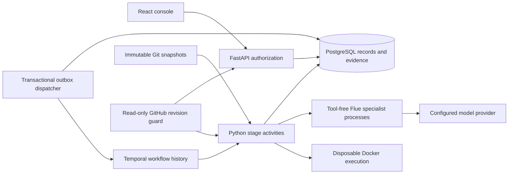
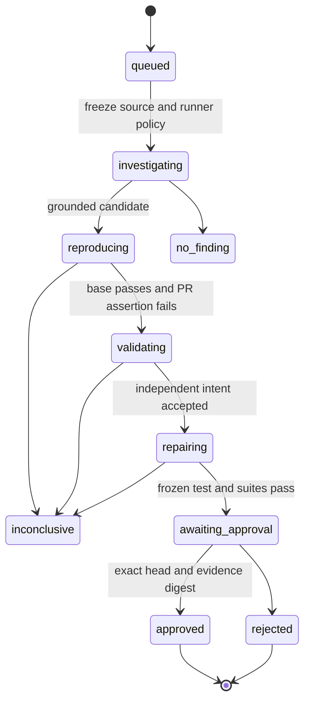

# Architecture and tradeoffs

## Responsibilities

| Component | Responsibility | Boundary |
| --- | --- | --- |
| Existing TypeScript reviewer | Diff parsing, static checks, bounded partition review, evidence grounding and CLI contracts | `src/stages`, `src/core`, `src/github` remain independently usable |
| Flue platform agent | Three specialist roles, independent intent validation, constrained repair output | No execution tools; one fresh process/conversation per request; strict Python response schemas |
| FastAPI service | Bearer identity, repository roles, review submission, immutable artifact reads and decisions | Never accepts arbitrary repository paths, commands, model endpoints or tenant IDs from browser requests |
| PostgreSQL | Tenant quotas, memberships, immutable evidence records, review bindings, audit events and dispatch outbox | Composite foreign keys prevent artifacts/memberships from binding across tenant boundaries |
| Temporal | Stage ordering, retry scheduling, persisted workflow history and worker recovery | Workflow code performs no database, network or filesystem I/O |
| Docker controller | Credential-free execution volumes and job lifecycle | A trusted service with access to a dedicated Docker daemon |
| Execution container | Run the frozen test or configured existing suite | No network, credentials, Docker socket or writable source/test mount |

Flue handles bounded model conversations. Temporal handles the durable business lifecycle. There is no second Python job queue. SQLite is used only in fast unit tests; PostgreSQL runs the demonstrated API and stores platform records. The local Temporal server stores its own history in a separate persistent development volume.

## Evidence and state transitions

A stale revision can supersede any active review. Unrecoverable activity errors produce `failed`. Results that cannot demonstrate the regression or a valid fix remain `inconclusive`, with evidence retained. Rejected decisions are final.

A snapshot contains base/PR source, exact commit IDs, the existing suite command, immutable Docker image ID and repairable source paths. Every execution uses that captured image ID, so changing a mutable image tag cannot change the environment halfway through a review. Three specialist roles run with a maximum of three parallel requests, each returning at most one candidate. Every referenced excerpt must match its claimed line in the head snapshot. All candidates are retained; this first version progresses one candidate per review, in stable role order, through reproduction and repair.

The independent validator gets a separate conversation, source contracts and execution evidence. It can veto the original finding. A model verdict is still a judgment; grounding verifies references, not semantic truth. The test must pass on base and fail with a unittest assertion on the PR. Syntax errors, timeouts and infrastructure failures do not establish a regression.

The repair author supplies replacements for explicitly allowed source files. It cannot replace the frozen test or invoke a command. Validation reruns the identical test bytes against the candidate, checks the head's existing suite as a baseline, and checks the candidate's suite. The bundle binds patch, head/base commits, test hash, source snapshot hash, proposal hash, intent decision and execution logs. Existing tests must pass before and after the fix.

Approval compares the exact head and bundle digest under a row lock, checks current revisions, and records the authenticated user. Artifact exports require the approved state and another revision check. Local application fetches that authorization again, requires an exact clean checkout and applies the validated patch. The platform does not automatically commit, push or merge.

## Recovery, limits and external effects

Review submission holds a tenant row lock while reserving quota and a repository lock while superseding prior work. Unique constraints make duplicate submissions return the existing review. A database outbox flag survives a crash before Temporal dispatch. The dispatcher uses `review-<id>` as the workflow ID; a lost start acknowledgement is reconciled with the same ID.

Each activity adopts an existing immutable result on retry. Completed evidence therefore survives a lost activity acknowledgement. Temporal has a three-attempt policy for transient failures, and worker concurrency is bounded to four activities. At most twelve specialist calls can run per worker while investigations occupy all slots. Each Flue call has its own network/output limits. Tenant allowances reserve one review at submission; each review's specialist plan has a fixed upper bound. This is not token-accurate billing.

Superseded workflows receive cancellation. Activity writes check state under a lock, so a late worker cannot replace evidence after supersession. The controller also rechecks revisions between execution jobs. An already-running sandbox may finish its bounded job before cancellation is observed; its late result cannot authorize a patch. Multi-worker deployments multiply the configured concurrency; deploy a fixed worker count to enforce an installation-wide cap.

The shared TypeScript GitHub integration publishes source-grounded reviews through CLI, Action and App entry points. The console explicitly publishes its reproduced evidence through `publication.py`, with role checks, current revision validation, artifact integrity checks and bot-owned receipt reconciliation. Publication never approves a repair or merges a PR.

## Execution and trust boundaries

The controller copies only validated relative UTF-8 paths from Git archive output, rejecting links and special files. The supported snapshot is deliberately bounded to 200 files and 512 KB of source. Hidden files are excluded. The snapshot reader never checks out PR code or invokes repository hooks.

Inputs are staged into a job-specific Docker volume through a container that is never started. The execution container mounts that volume read-only and runs as UID 65534 with dropped capabilities, no new privileges, a read-only root, no network, one CPU, 256 MB memory, 64 processes and bounded output. Only `/tmp` is writable. An image-owned watchdog stops the test after 30 seconds even if the controller disappears. Normal completion removes the container and volume.

Reviewed code and model tests are untrusted. Containers share a kernel, so internet-facing arbitrary-code workloads need a dedicated worker host and a stronger runtime such as a VM or sandboxed container runtime. A reviewed program can also try to game its own test behavior; frozen tests, paired revisions and independent validation improve evidence without constituting a proof of arbitrary program correctness. Do not mount host credentials or a Docker socket inside execution containers.

The controller's Docker access is privileged infrastructure access. Run it separately from the API, keep its daemon private, and scope model/GitHub credentials to their services. Persisted source and logs are tenant data and belong in your encrypted database/backups. API authorization covers every artifact and review read. The schema adds structural tenant constraints; it does not rely on PostgreSQL row-level security.

A controller process killed during cleanup can leave a labelled stopped container or input volume. Inspect only resources with `review-platform.execution=true` and remove confirmed orphan resources after checking active jobs. Automated retention and garbage collection, credential rotation/expiry, SSO, generalized dependency builds and multi-language execution remain concrete operational extensions.

References used for the implementation: [Temporal Python SDK and worker behavior](https://github.com/temporalio/sdk-python), [Docker security model](https://docs.docker.com/engine/security/), and [Docker network drivers](https://docs.docker.com/engine/network/drivers/). Runtime evidence is recorded separately in [verification](verification.md).
